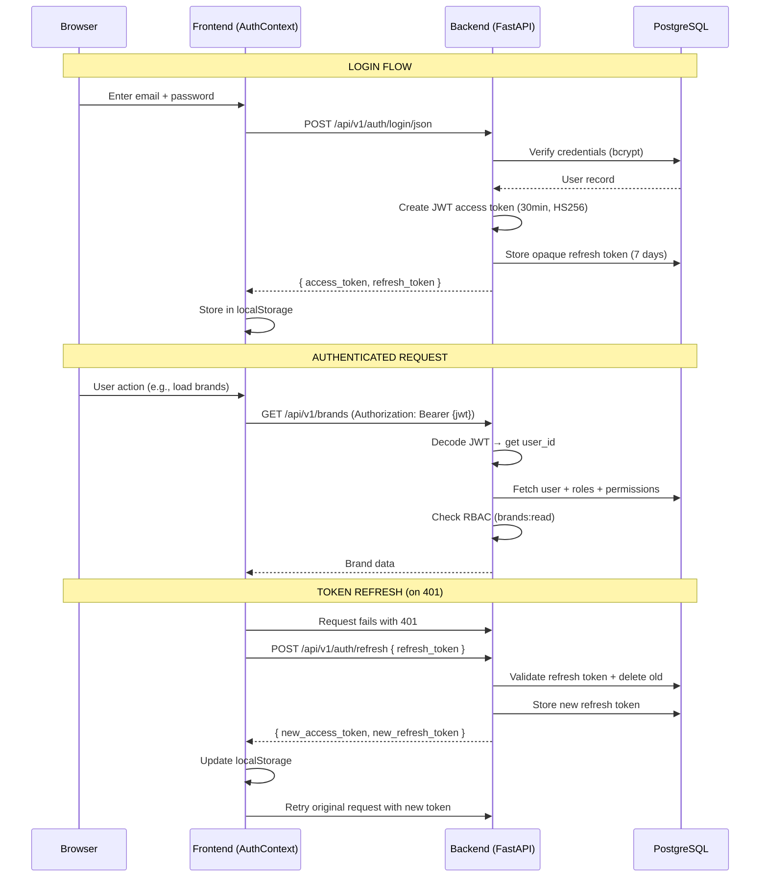
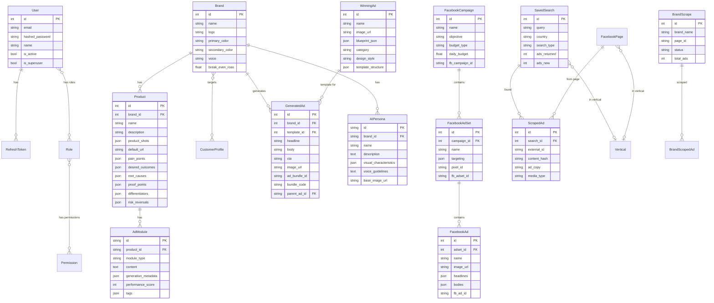

# Townsquare Interactive Ad Creative Studio — Architecture Diagram

## System Overview

```
┌─────────────────────────────────────────────────────────────────────────────────────┐
│                  Townsquare Interactive Ad Creative Studio (TSI)                     │
│                    AI-Powered Full-Stack Ad Lifecycle Automation                     │
└─────────────────────────────────────────────────────────────────────────────────────┘

┌──────────────────────────────────┐          ┌──────────────────────────────────────┐
│         FRONTEND                 │          │            BACKEND                   │
│   React 19 + Vite 7 + Tailwind  │  HTTP    │      Python FastAPI 0.104            │
│   Railway: "frontend" service   │◄────────►│   Railway: "fb-builder" service      │
│   Port: 5173 (dev)              │  REST    │   Port: 8000                         │
│   Served by: npx serve          │  JSON    │   Served by: Uvicorn                 │
└──────────────────────────────────┘          └──────────────┬───────────────────────┘
                                                            │
                                              ┌─────────────┼─────────────┐
                                              │             │             │
                                              ▼             ▼             ▼
                                     ┌──────────┐  ┌──────────┐  ┌──────────────┐
                                     │PostgreSQL│  │Cloudflare│  │ External APIs │
                                     │ Railway  │  │    R2    │  │ (see below)  │
                                     └──────────┘  └──────────┘  └──────────────┘
```

---

## High-Level Architecture Flow

```mermaid
flowchart TB
    subgraph USER["👤 User (Browser)"]
        Browser["Browser Client"]
    end

    subgraph FRONTEND["Frontend — React 19 + Vite 7"]
        direction TB
        Router["React Router v7"]
        Auth["AuthContext<br/>JWT + Refresh Tokens"]
        Brand["BrandContext<br/>Brands, Products, Profiles"]
        Campaign["CampaignContext<br/>Campaign Wizard State"]
        Toast["ToastContext<br/>Notifications"]

        subgraph PAGES["Pages"]
            P1["Dashboard"]
            P2["Research / Brand Scrapes"]
            P3["Script Factory / Ad Modules"]
            P4["Audience (Profiles / AI Personas)"]
            P5["Build Creatives (Image/Video)"]
            P6["Winning Ads / Ad Remix"]
            P7["Generated Ads"]
            P8["Facebook Campaigns (6-step wizard)"]
            P9["Analytics / Reporting"]
            P10["Settings / User Management"]
        end
    end

    subgraph BACKEND["Backend — FastAPI 0.104"]
        direction TB
        MW["Middleware Stack<br/>CORS · Security Headers · Rate Limiting · Proxy"]

        subgraph ROUTES["20 API Routers (/api/v1)"]
            R1["auth · users"]
            R2["brands · products · profiles"]
            R3["research · brand-scrapes"]
            R4["generated-ads · templates"]
            R5["copy-generation · ad-remix"]
            R6["facebook · uploads"]
            R7["dashboard · prompts · ad-styles"]
            R8["modular-generation · ad-modules · naming"]
            R9["performance · personas"]
        end

        subgraph SERVICES["Service Layer"]
            S1["FacebookService"]
            S2["ResearchService"]
            S3["AdRemixService"]
            S4["BrandScraperService"]
            S5["SchedulerService"]
            S6["RateLimiter"]
            S7["AgentOrchestrator<br/>5 AI Agents"]
        end

        subgraph SECURITY["Auth & Security"]
            JWT["JWT Access Tokens (30min)"]
            RT["Opaque Refresh Tokens (7 days)"]
            RBAC["RBAC: User → Roles → Permissions"]
        end
    end

    subgraph EXTERNAL["External Services"]
        GEMINI["Google Gemini AI<br/>Copy + Vision Analysis"]
        FALAI["Fal.ai<br/>Image Generation"]
        FBAPI["Facebook Marketing API<br/>Campaigns, Ad Sets, Ads"]
        FBLIB["Facebook Ads Library API<br/>Competitor Research"]
        R2["Cloudflare R2<br/>Media Storage (S3-compatible)"]
        PG["PostgreSQL<br/>Railway Shared Instance"]
    end

    Browser --> Router
    Router --> Auth
    Auth -->|authFetch()| MW
    MW --> ROUTES
    ROUTES --> SERVICES

    S1 --> FBAPI
    S2 --> FBLIB
    S3 --> GEMINI
    S4 --> R2
    S5 --> S2

    R5 --> GEMINI
    R5 --> FALAI
    R6 --> R2
    R8 --> S7
    S7 --> GEMINI
    ROUTES --> PG
```

---

## External Tools & Integrations

```
┌──────────────────────────────────────────────────────────────────────────────────┐
│                         EXTERNAL SERVICES & TOOLS                                │
├──────────────────────────────────────────────────────────────────────────────────┤
│                                                                                  │
│  ┌─────────────────────┐   ┌─────────────────────┐   ┌─────────────────────┐    │
│  │   GOOGLE GEMINI     │   │      FAL.AI          │   │  FACEBOOK MARKETING │    │
│  │                     │   │                      │   │       API           │    │
│  │  Model: gemini-1.5  │   │  Image Generation    │   │  Version: v21.0    │    │
│  │         -flash      │   │  from text prompts   │   │  SDK: facebook-    │    │
│  │                     │   │                      │   │       business     │    │
│  │  Uses:              │   │  Uses:               │   │                    │    │
│  │  • Ad copy writing  │   │  • Create ad images  │   │  Uses:             │    │
│  │    (3-5 variations) │   │    from AI prompts   │   │  • Create campaigns│    │
│  │  • Template vision  │   │  • Style-based       │   │  • Create ad sets  │    │
│  │    analysis         │   │    generation        │   │  • Create ads      │    │
│  │  • Ad remix:        │   │                      │   │  • Get ad accounts │    │
│  │    deconstruct &    │   │  API Key:            │   │  • Get pixels      │    │
│  │    reconstruct      │   │  FAL_AI_API_KEY      │   │  • Get pages       │    │
│  │  • Field-level      │   │                      │   │  • Budget mgmt     │    │
│  │    regeneration     │   └──────────────────────┘   │    (CBO & ABO)     │    │
│  │                     │                              │  • Targeting       │    │
│  │  API Key:           │   ┌─────────────────────┐   │  • Advantage+      │    │
│  │  GEMINI_API_KEY     │   │  FACEBOOK ADS       │   │                    │    │
│  └─────────────────────┘   │  LIBRARY API        │   │  Tokens:           │    │
│                            │                      │   │  FACEBOOK_ACCESS_  │    │
│  ┌─────────────────────┐   │  Endpoint:           │   │    TOKEN           │    │
│  │  CLOUDFLARE R2      │   │  graph.facebook.com  │   │  FACEBOOK_APP_ID   │    │
│  │  (S3-Compatible)    │   │  /v21.0/ads_archive  │   │  FACEBOOK_APP_     │    │
│  │                     │   │                      │   │    SECRET           │    │
│  │  SDK: boto3         │   │  Uses:               │   └─────────────────────┘   │
│  │                     │   │  • Search competitor  │                              │
│  │  Uses:              │   │    ads by keyword    │   ┌─────────────────────┐    │
│  │  • Store ad images  │   │  • Filter by country │   │     POSTGRESQL      │    │
│  │  • Store scraped    │   │  • Page-level search │   │     (Railway)       │    │
│  │    brand media      │   │  • Dedup via SHA256  │   │                     │    │
│  │  • Video storage    │   │                      │   │  24 SQLAlchemy      │    │
│  │                     │   │  Fallback:           │   │  models             │    │
│  │  Fallback: local    │   │  Chromium scraper    │   │                     │    │
│  │  /uploads dir       │   │  when API returns    │   │  Shared by frontend │    │
│  │                     │   │  0 results           │   │  & backend services │    │
│  │  Env Vars:          │   │                      │   │                     │    │
│  │  R2_ACCOUNT_ID      │   │  Token:              │   │  Migrations:        │    │
│  │  R2_ACCESS_KEY_ID   │   │  FACEBOOK_ADS_       │   │  Alembic (manual)   │    │
│  │  R2_SECRET_ACCESS_  │   │    LIBRARY_TOKEN     │   │                     │    │
│  │    KEY              │   └──────────────────────┘   │  Init: init_db.py   │    │
│  │  R2_BUCKET_NAME     │                              │  (auto on deploy)   │    │
│  │  R2_PUBLIC_URL      │                              └─────────────────────┘    │
│  └─────────────────────┘                                                         │
│                                                                                  │
│  ┌──────────────────────────────────────────────────────────────────────────┐    │
│  │                          RAILWAY (Hosting)                               │    │
│  │                                                                          │    │
│  │   Service 1: "fb-builder"     Service 2: "frontend"    Service 3: PG    │    │
│  │   Python backend              React SPA                 PostgreSQL DB   │    │
│  │   Dockerfile (3.11-slim)      Nixpacks (Node 22)        Managed DB     │    │
│  │   Runs init_db.py + uvicorn   Vite build + npx serve                    │    │
│  └──────────────────────────────────────────────────────────────────────────┘    │
│                                                                                  │
└──────────────────────────────────────────────────────────────────────────────────┘
```

---

## Authentication & Security Flow



---

## RBAC Permission Model

```
┌──────────────────────────────────────────────────────────────────┐
│                    ROLE-BASED ACCESS CONTROL                     │
├──────────────────────────────────────────────────────────────────┤
│                                                                  │
│  User ──M:M──► Role ──M:M──► Permission                        │
│                                                                  │
│  ┌──────────┐  ┌──────────────────────────────────────────────┐ │
│  │  admin   │──│ brands:* · products:* · ads:* · campaigns:* │ │
│  │          │  │ templates:* · users:read · users:write       │ │
│  └──────────┘  └──────────────────────────────────────────────┘ │
│  ┌──────────┐  ┌──────────────────────────────────────────────┐ │
│  │ manager  │──│ brands:read/write · products:read/write     │ │
│  │          │  │ ads:read/write · campaigns:read/write        │ │
│  │          │  │ templates:read/write                         │ │
│  └──────────┘  └──────────────────────────────────────────────┘ │
│  ┌──────────┐  ┌──────────────────────────────────────────────┐ │
│  │  editor  │──│ brands:read · products:read · ads:read/write│ │
│  │          │  │ templates:read/write                         │ │
│  └──────────┘  └──────────────────────────────────────────────┘ │
│  ┌──────────┐  ┌──────────────────────────────────────────────┐ │
│  │  viewer  │──│ brands:read · products:read · ads:read      │ │
│  │          │  │ templates:read · campaigns:read              │ │
│  └──────────┘  └──────────────────────────────────────────────┘ │
│                                                                  │
│  is_superuser = true  →  bypasses ALL permission checks         │
└──────────────────────────────────────────────────────────────────┘
```

---

## Database Schema (24 Models)



---

## Frontend Component Tree

```
App.jsx
├── ToastProvider ─────────── Toast notifications (success/error/warning/info)
│   └── Toast.jsx             Fixed top-right, auto-dismiss (5s)
│
├── AuthProvider ─────────── JWT state, login/logout, authFetch(), hasRole()
│   └── Stores tokens in localStorage, auto-refresh every 6 days
│
├── BrandProvider ────────── Brands, Products, CustomerProfiles CRUD
│   └── Fetches on auth, shared across all pages
│
├── CampaignProvider ─────── Facebook campaign wizard state
│   └── campaignData, adsetData, creativeData, adsData
│
└── BrowserRouter
    ├── /login ──────────────── Login.jsx (public)
    │
    └── / (PrivateRoute + Layout with collapsible sidebar)
        │
        ├── /                    Dashboard ────────── Stats, quick actions, recent activity
        │
        ├── AUDIENCE
        │   ├── /profiles        CustomerProfiles ── Audience segments, brand linking
        │   └── /personas        AIPersonas ──────── Custom AI personas per brand
        │
        ├── COMPETITOR RESEARCH
        │   ├── /research        Research ────────── Search Facebook Ads Library
        │   │                                        Keyword search, country filter
        │   │                                        Blacklist management, rate limiting
        │   ├── /research/brand-scrapes  BrandScrapes ── Scrape full brand ad libraries
        │   └── /research/settings       ResearchSettings
        │
        ├── AD CREATION
        │   ├── /build-creatives CreateAds ────────── Choose image or video format
        │   ├── /image-ads       ImageAds ─────────── 8-step wizard:
        │   │                      Brand → Product → Template → Copy → Style
        │   │                      → Analyze → Bulk Create → Preview
        │   ├── /video-ads       VideoAds ─────────── Multi-step video ad builder
        │   ├── /winning-ads     WinningAds ───────── Upload templates, analyze with AI
        │   ├── /ad-remix        AdRemix ──────────── Deconstruct → Blueprint → Reconstruct
        │   └── /generated-ads   GeneratedAds ─────── Browse, filter, export created ads
        │
        ├── SCRIPT FACTORY (Modular Creative Strategist)
        │   ├── /modular-ads         ModularAds ──────── Modular Matrix generator
        │   │                          4-block taxonomy: Intro → Bridge → Core → CTA
        │   │                          Micro-Movie mode with 12 emotional avatars
        │   └── /ad-modules-library  AdModulesLibrary ── Browse, filter, manage ad modules
        │
        ├── CAMPAIGN MANAGEMENT
        │   └── /facebook-campaigns  FacebookCampaigns ── 6-step wizard:
        │                              1. Select Ad Account
        │                              2. Configure Campaign (objective, budget)
        │                              3. Set Up Ad Set (targeting, geo, age)
        │                              4. Create Ad Creative (images, copy, CTA)
        │                              5. Bulk Ad Creation
        │                              6. Review & Launch
        │
        ├── ANALYTICS
        │   └── /reporting       Reporting ────────── Performance Intelligence + Kill Rule
        │                          CSV import → Fit Score (0-5) → KILL/SCALE flags
        │
        └── ADMIN
            ├── /settings        Settings ─────────── Ad styles, prompts, general config
            └── /users           UserManagement ───── User CRUD, role assignment (admin only)
```

---

## Core Feature Workflows

### 1. Competitor Research Flow

```
User searches keyword ──► Facebook Ads Library API (v21.0)
         │                         │
         │                    ┌────┴────┐
         │                    │ Results? │
         │                    └────┬────┘
         │               Yes ◄─────┴─────► No
         │                │                 │
         │          Apply filters      Chromium Scraper
         │          • Page blacklist       Fallback
         │          • Keyword blacklist     │
         │                │                 │
         │                ▼                 ▼
         │          Deduplicate ◄───────────┘
         │          (SHA256 hash)
         │                │
         │                ▼
         └───────► SavedSearch + ScrapedAds ──► PostgreSQL
                                                    │
                        Rate Limiter ◄──────────────┘
                   (200 calls / 59 min window)
```

### 2. AI Ad Generation Flow

```
Select Brand + Product + Customer Profile
              │
              ▼
    Select Winning Ad Template ──► Gemini Vision analyzes template
              │                    Extracts: layout, psychology,
              │                    narrative arc, visual style
              ▼
    Generate Ad Copy ──────────► Gemini AI writes 3-5 variations
              │                  (headlines, body, CTA)
              │                  2 styles: bullet-emoji or emotional
              ▼
    Select Ad Style ───────────► 40+ archetypes:
              │                  Trust & Authority, Problem/Solution,
              │                  Social Proof, Demonstration, Disruption
              ▼
    Generate Images ───────────► Fal.ai creates images from prompts
              │
              ▼
    Bulk Create ───────────────► Multiple sizes & combinations
              │                  Grouped by ad_bundle_id
              ▼
    GeneratedAd records ───────► PostgreSQL + R2 storage
```

### 3. Ad Remix Flow (Deconstruct → Reconstruct)

```
Upload Winning Ad Image
         │
         ▼
    DECONSTRUCT (Gemini Vision)
    Extracts blueprint_json:
    ├── Layout structure
    ├── Narrative arc
    ├── Text hierarchy
    ├── Psychological triggers
    ├── Visual style rules
    └── Color palette
         │
         ▼
    Blueprint stored in WinningAd.blueprint_json
         │
         ▼
    RECONSTRUCT (Gemini Generative)
    Inputs: blueprint + brand + product + profile
    Outputs: New ad concept
    ├── New headlines
    ├── New body copy
    ├── New CTA
    └── Style-matched to original
```

### 4. Facebook Campaign Launch Flow

```
Step 1: Select Ad Account ──► GET /facebook/accounts
Step 2: Create Campaign ────► POST /facebook/campaigns
         │                     (objective, budget type, daily budget)
Step 3: Create Ad Set ──────► POST /facebook/adsets
         │                     (targeting, geo, age, gender,
         │                      platforms, pixel, conversion event)
Step 4: Create Creative ────► Upload images, write headlines/bodies,
         │                     select CTA, set URLs
Step 5: Bulk Ad Creation ──► Create multiple ad variations
Step 6: Review & Launch ───► POST /facebook/ads
                              Ads go live on Facebook/Instagram
```

### 5. Modular Creative Strategist System

```
┌──────────────────────────────────────────────────────────────────────────────────┐
│                      MODULAR CREATIVE STRATEGIST                                 │
│              4-Block Taxonomy for Facebook Video Ad Scripts                       │
├──────────────────────────────────────────────────────────────────────────────────┤
│                                                                                  │
│  ┌────────────┐  ┌────────────┐  ┌────────────┐  ┌────────────┐                │
│  │   INTRO    │  │   BRIDGE   │  │    CORE    │  │    CTA     │                │
│  │  0 – 7 s   │─►│  7 – 20 s  │─►│ 20 – 40 s  │─►│ 40 – 50 s  │                │
│  │            │  │            │  │            │  │            │                │
│  │ Hook Types:│  │ Types:     │  │ Pathways:  │  │ Styles:    │                │
│  │ • Pain     │  │ • Mechanism│  │ • Logic    │  │ • Risk Rev │                │
│  │ • Curiosity│  │ • Analogy  │  │ • Social   │  │ • Scarcity │                │
│  │ • Shock    │  │ • Story    │  │   Proof    │  │ • Future   │                │
│  │ • Benefit  │  │ • Data     │  │ • Demo     │  │   Pace     │                │
│  └────────────┘  └────────────┘  └────────────┘  └────────────┘                │
│                                                                                  │
│  NAMING CONVENTION                                                               │
│  ─────────────────                                                               │
│  I-PAIN-Q-03_B-MEC-A_C-LOGIC_CTA-RISKREV-01                                    │
│  │  │    │  │   │  │    │          │                                             │
│  │  Hook Format ID  Bridge Core    CTA style                                    │
│  Intro       type   type   pathway                                               │
│                                                                                  │
├──────────────────────────────────────────────────────────────────────────────────┤
│                                                                                  │
│  5 SPECIALIZED AI AGENTS (Gemini)                                                │
│  ─────────────────────────────────                                               │
│  ┌─────────────┐ ┌─────────────┐ ┌─────────────┐ ┌─────────────┐              │
│  │ IntroAgent  │ │ BridgeAgent │ │  CoreAgent  │ │  CtaAgent   │              │
│  │ Hook types  │ │ Connects    │ │ Persuasion  │ │ Close       │              │
│  │ & formats   │ │ hook→core   │ │ pathways    │ │ techniques  │              │
│  └─────────────┘ └─────────────┘ └─────────────┘ └─────────────┘              │
│                  ┌─────────────────────────┐                                     │
│                  │    MicroMovieAgent      │                                     │
│                  │  12 emotional avatars    │                                     │
│                  │  30-60s short stories    │                                     │
│                  │  Product at 40-50% mark  │                                     │
│                  └─────────────────────────┘                                     │
│                                                                                  │
│  All agents orchestrated by AgentOrchestrator                                    │
│  Product Brief required: pain_points, desired_outcomes, root_causes,             │
│  proof_points, differentiators, risk_reversals                                   │
│                                                                                  │
├──────────────────────────────────────────────────────────────────────────────────┤
│                                                                                  │
│  PERFORMANCE SCORING & KILL RULE                                                 │
│  ────────────────────────────────                                                │
│  CSV Import ──► Parse Ad Names ──► Match UUID fragments to AdModules            │
│                                                                                  │
│  Fit Score (0-5) based on deepest funnel event:                                  │
│    5: AddPaymentInfo  │  4: InitiateCheckout  │  3: AddToCart                   │
│    2: Contact         │  1: Lead              │  0: CompleteRegistration         │
│                                                                                  │
│  Kill Rule (7-day):                                                              │
│    Score ≤ 1 + spend > threshold  →  KILL  (replace chunk)                      │
│    Score ≥ 4 + spend > threshold  →  SCALE (keep as control)                    │
│    Threshold = Brand.break_even_roas (default $50)                               │
│                                                                                  │
├──────────────────────────────────────────────────────────────────────────────────┤
│                                                                                  │
│  PDCA EXPORT                                                                     │
│  ───────────                                                                     │
│  Cartesian product of all modules for a product (Intro × Bridge × Core × CTA)  │
│  Grouped by Bridge type into Ad Groups (AG-Mechanism, AG-Analogy, etc.)         │
│  Capped at 5000 combinations — CSV-ready payload for campaign upload             │
│                                                                                  │
└──────────────────────────────────────────────────────────────────────────────────┘
```

---

## Backend Middleware & Security Stack

```
Incoming Request
      │
      ▼
┌─────────────────────────────────────┐
│  ProxyHeadersMiddleware             │  Trust Railway reverse proxy
│  (X-Forwarded-For, X-Forwarded-    │  Configurable: TRUSTED_PROXIES
│   Proto headers)                    │
└─────────────────┬───────────────────┘
                  ▼
┌─────────────────────────────────────┐
│  CORS Middleware                    │  Origins: ALLOWED_ORIGINS env var
│  Methods: GET,POST,PUT,DELETE,      │  + localhost:5173, localhost:3000
│           PATCH,OPTIONS             │  No wildcard * in production
│  Headers: Content-Type,             │  Max-age: 600s
│           Authorization             │
└─────────────────┬───────────────────┘
                  ▼
┌─────────────────────────────────────┐
│  Security Headers Middleware        │  X-Content-Type-Options: nosniff
│  (Custom)                           │  X-Frame-Options: DENY
│                                     │  X-XSS-Protection: 1; mode=block
│                                     │  Referrer-Policy: strict-origin
│                                     │  HSTS: max-age=31536000 (HTTPS)
└─────────────────┬───────────────────┘
                  ▼
┌─────────────────────────────────────┐
│  Rate Limiting (slowapi)            │  Register: 3/min
│  Key: IP address                    │  Login: 5/min
│                                     │  Refresh: 10/min
│                                     │  Research: 200/59min (DB-backed)
└─────────────────┬───────────────────┘
                  ▼
┌─────────────────────────────────────┐
│  JWT Authentication                 │  Bearer token in Authorization
│  (OAuth2PasswordBearer)             │  HS256 algorithm
│                                     │  30-min access tokens
└─────────────────┬───────────────────┘
                  ▼
┌─────────────────────────────────────┐
│  RBAC Authorization                 │  Depends(get_current_active_user)
│  (FastAPI Dependencies)             │  require_role() / require_permission()
│                                     │  is_superuser bypasses all
└─────────────────┬───────────────────┘
                  ▼
            Route Handler
```

---

## Tech Stack Summary

| Layer | Technology | Purpose |
|-------|-----------|---------|
| **Frontend Framework** | React 19 | UI components & state |
| **Build Tool** | Vite 7 | Dev server, bundling, HMR |
| **CSS** | TailwindCSS 3.4 | Utility-first styling |
| **Icons** | lucide-react | 40+ icon types |
| **Routing** | React Router v7 | Client-side navigation |
| **HTTP Client** | authFetch (native) + axios | API calls with JWT |
| **Backend Framework** | FastAPI 0.104 | REST API server |
| **ASGI Server** | Uvicorn | Async HTTP server |
| **ORM** | SQLAlchemy 2.0 | Database abstraction |
| **Migrations** | Alembic | Schema versioning |
| **Database** | PostgreSQL (Railway) | Primary data store |
| **Auth** | JWT (python-jose) + bcrypt | Authentication |
| **AI - Text** | Google Gemini 1.5 Flash | Copy generation, vision analysis |
| **AI - Images** | Fal.ai | AI image generation |
| **Social API** | Facebook Marketing API v21 | Campaign management |
| **Research API** | Facebook Ads Library API | Competitor ad research |
| **Object Storage** | Cloudflare R2 (boto3) | Media files (S3-compatible) |
| **Rate Limiting** | slowapi + custom DB limiter | API abuse prevention |
| **Hosting** | Railway | 3 services: backend, frontend, DB |
| **Testing - Frontend** | Vitest + Testing Library | Unit & component tests |
| **Testing - Backend** | pytest + pytest-asyncio | Unit & integration tests |
| **Testing - E2E** | agent-browser | Smoke tests |
| **Linting** | ESLint (frontend), flake8 (backend) | Code quality |
| **Formatting** | Prettier (frontend), Black + isort (backend) | Code style |
| **Security Scan** | bandit | Python security audit |

---

## API Endpoint Map (20 Routers, 75+ Endpoints)

```
/api/v1/
├── auth/
│   ├── POST /register          Create user (admin only, 3/min)
│   ├── POST /login             OAuth2 form login (5/min)
│   ├── POST /login/json        JSON body login (5/min)
│   ├── POST /refresh           Refresh token (10/min)
│   ├── POST /logout            Invalidate refresh token
│   ├── GET  /me                Current user info
│   └── PUT  /me                Update profile
│
├── users/
│   ├── GET    /                List users (superuser)
│   ├── GET    /{id}            Get user (superuser)
│   ├── PUT    /{id}            Update user (superuser)
│   ├── DELETE /{id}            Delete user (superuser)
│   ├── PUT    /{id}/roles      Assign roles (superuser)
│   ├── GET    /roles/          List roles
│   ├── POST   /roles/          Create role
│   ├── DELETE /roles/{id}      Delete role
│   ├── PUT    /roles/{id}/permissions  Update permissions
│   ├── GET    /permissions/    List permissions
│   └── POST   /permissions/    Create permission
│
├── brands/
│   ├── GET    /                List brands
│   ├── POST   /                Create brand
│   ├── PUT    /{id}            Update brand
│   └── DELETE /{id}            Delete brand
│
├── products/
│   ├── GET    /                List products
│   ├── GET    /{id}            Get product
│   ├── POST   /                Create product
│   ├── PUT    /{id}            Update product
│   └── DELETE /{id}            Delete product
│
├── profiles/
│   ├── GET    /                List customer profiles
│   ├── POST   /                Create profile
│   ├── PUT    /{id}            Update profile
│   └── DELETE /{id}            Delete profile
│
├── research/
│   ├── POST /search            Search ads (no save)
│   ├── POST /search-and-save   Search + save results
│   ├── GET  /saved-searches    List saved searches
│   ├── GET  /saved-searches/{id}  Get search with ads
│   ├── DELETE /saved-searches/{id}  Delete search
│   ├── GET  /api-usage         API usage stats
│   ├── POST /brand-scrapes     Scrape brand page (async)
│   └── GET  /brand-scrapes     List brand scrapes
│
├── generated-ads/
│   ├── POST /generate          Generate ads from template
│   ├── GET  /                  List generated ads
│   ├── GET  /{id}              Get specific ad
│   ├── DELETE /{id}            Delete ad
│   └── POST /export            Export as CSV
│
├── templates/
│   ├── GET  /                  List winning ads/templates
│   ├── GET  /filters           Available categories/styles
│   ├── GET  /{id}/preview      Template preview
│   └── POST /upload            Upload template images
│
├── copy-generation/
│   ├── POST /generate          AI copy (3-5 variations)
│   └── POST /regenerate-field  Regenerate headline/body/CTA
│
├── ad-remix/
│   ├── POST /deconstruct       Analyze template → blueprint
│   ├── POST /reconstruct       Blueprint → new ad concept
│   ├── GET  /blueprints/{id}   Get template blueprint
│   └── GET  /blueprints        List blueprinted templates
│
├── facebook/
│   ├── GET  /accounts          Ad accounts
│   ├── GET  /campaigns         List campaigns
│   ├── POST /campaigns         Create campaign
│   ├── GET  /pixels            Conversion pixels
│   ├── GET  /pages             Facebook Pages
│   ├── GET  /adsets            List ad sets
│   ├── GET  /ads               List ads
│   └── POST /adsets            Create ad set
│
├── uploads/
│   └── POST /                  Upload file (images ≤10MB, videos ≤500MB)
│
├── dashboard/
│   └── GET  /stats             Aggregated statistics
│
├── prompts/
│   ├── GET    /                List prompts
│   ├── GET    /{id}            Get prompt
│   ├── POST   /                Create prompt
│   ├── PUT    /{id}            Update prompt
│   └── DELETE /{id}            Delete prompt
│
├── ad-styles/
│   ├── GET    /                List styles (filter by category)
│   ├── GET    /{id}            Get style
│   ├── POST   /                Create style
│   ├── PUT    /{id}            Update style
│   └── DELETE /{id}            Delete style
│
├── modular-generation/
│   ├── POST /generate          Generate modular script blocks
│   └── POST /iterate           Generate variations of winning module
│
├── ad-modules/
│   ├── GET    /                List modules (filter by product_id)
│   ├── POST   /                Create module
│   ├── GET    /{id}            Get module
│   ├── PUT    /{id}            Update module
│   └── DELETE /{id}            Delete module
│
├── naming/
│   ├── POST /assemble          Combine 4 modules → bundle code
│   └── GET  /export-combinations/{product_id}  PDCA export
│
├── performance/
│   ├── POST /import            Import Facebook CSV performance data
│   └── GET  /kill-rule         Get kill/scale flags
│
└── personas/
    ├── GET    /                List personas (filter by brand_id)
    ├── POST   /                Create persona
    ├── PUT    /{id}            Update persona
    └── DELETE /{id}            Delete persona
```
